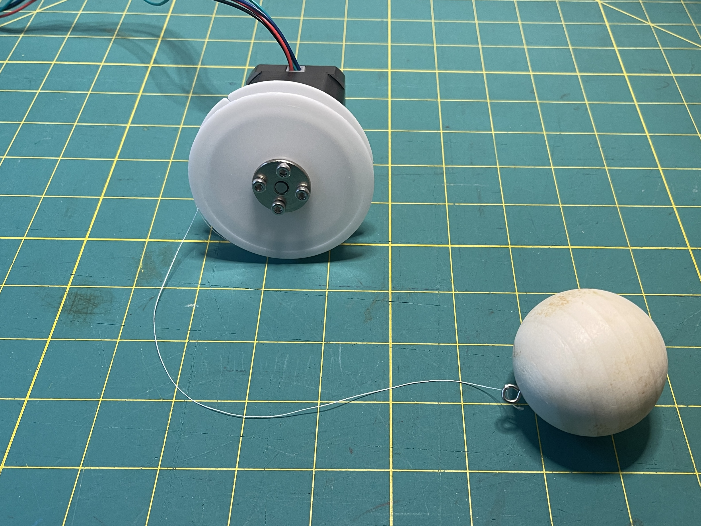
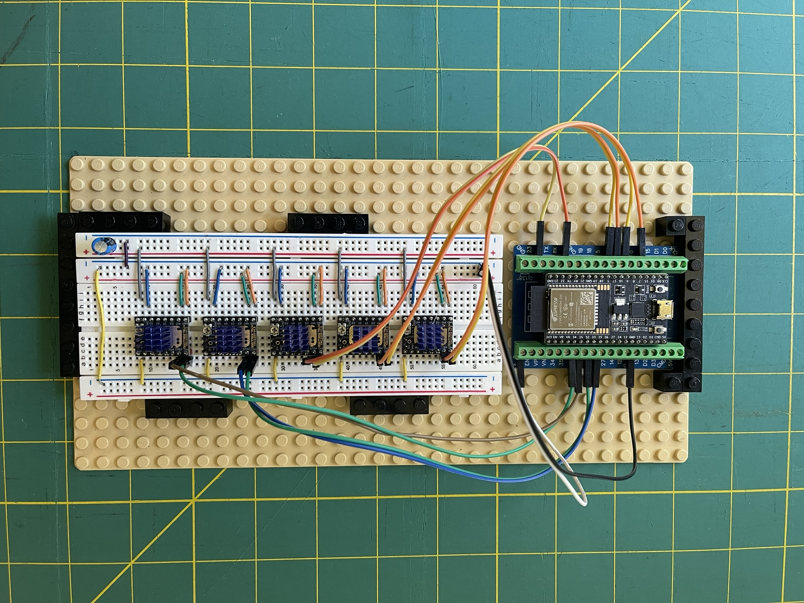
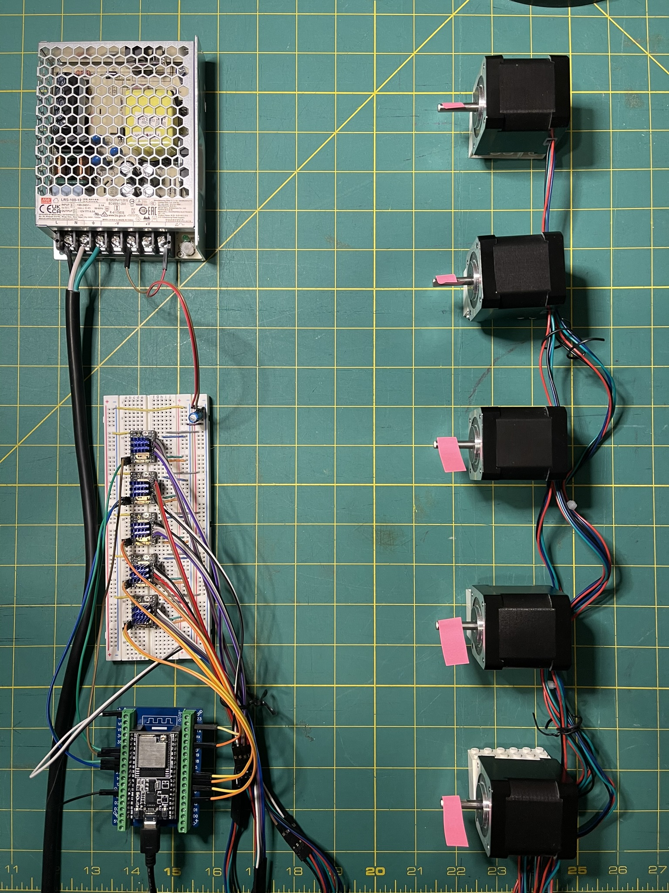

# Kinetic Hanging Sculpture

A research and development project for a hanging mechanical sculpture where multiple suspended elements are independently controlled to create dynamic, wave-like movements.

This repository contains the C++ code and winch design for a self-contained, pre-programmed prototype using an ESP32, stepper motors, and the AccelStepper library to generate a synchronized sine wave animation.

> *   **YouTube Demo:** [https://youtu.be/g7hZ9SLusAE](https://youtu.be/g7hZ9SLusAE)


## Features

*   **Precise Kinetic Motion:** Utilizes NEMA 17 stepper motors and TMC2209 drivers for accurate, quiet, and smooth vertical actuation.
*   **Multi-Axis Choreography:** The C++ code uses the AccelStepper library to generate complex, non-blocking, multi-motor animation sequences (e.g., a sine wave with phase offsets).
*   **Resourceful Mechanical Design:** Features a custom-designed winch mechanism engineered by adapting common off-the-shelf components like plastic thread spools and motor shaft couplings.

---

## I/O Diagram (Version 2 Prototype)
```
INPUT:  [N/A - Pre-programmed Animation]
OUTPUT: [ESP32/Arduino IDE (Processor/C++)] ---> (STEP/DIR) ---> [5x TMC2209 Drivers (Motor Control Board)] ---> (Phase Current) ---> [5x Stepper Motors (Actuator)]
```
> - Animation logic (e.g., sine wave) is programmed directly on the ESP32 using the AccelStepper library.

---

## Repository Contents

*   **C++ Code (`.ino` file):** The complete Arduino IDE sketch for the ESP32. It includes motor setup, parameter definitions, and the main animation loop for generating the sine wave motion.
*   **Images:** Photos detailing the construction of the custom winch mechanism.

---

## Setup & Usage

### Hardware Requirements

*   ESP32-DevKitC-32E Development Board
*   NEMA 17 Stepper Motors
*   TMC2209 Stepper Motor Drivers
*   12V Power Supply (e.g., Mean Well LRS-100-12)
*   Custom-built winch mechanisms (see images for reference)

### Software Requirements

*   Arduino IDE with the ESP32 board manager installed.
*   Required Arduino Library: `AccelStepper` by Mike McCauley.

### Instructions

1.  **Hardware Assembly:** Connect the stepper motors to the TMC2209 drivers and the drivers to the specified GPIO pins on the ESP32. Ensure the motors are powered by the external 12V power supply.
2.  **Upload Code:** Open the `.ino` file in the Arduino IDE and upload it to your ESP32 board.
3.  **Run:** After a 10-second startup delay, the motors will perform a brief settling movement and then begin the continuous sine wave animation sequence.

---

## Winch Mechanism Design

A key part of this research was developing a simple, reliable, and replicable winch mechanism using common off-the-shelf components. The goal was to create a functional system without the need for custom 3D printing or specialized parts.


### Bill of Materials (per winch)

| Part                  | Product Link                                                                                             | Notes                                           |
| --------------------- | -------------------------------------------------------------------------------------------------------- | ----------------------------------------------- |
| **Stepper Motor**       | NEMA 17                                                                                                  | Standard 5mm D-shaft                            |
| **Motor Shaft Coupler** | [5mm Flange Coupling](https://www.amazon.com/dp/B092Z7Q3X9)                                                | Connects the motor to the spool                 |
| **Spool**               | [2.64" Plastic Wire Spools](https://www.amazon.com/dp/B07X3Y2Z8J)                                          | Serves as the winch drum                        |
| **Suspended Object**    | [2-inch (50mm) Wooden Ball](https://www.amazon.com/dp/B089Q7XJ6Y)                                           | The kinetic element                             |
| **Line**                | [15lb Braided Fishing Line](https://www.amazon.com/dp/B07D37T6Y8)                                          | Low stretch and high strength                   |
| **Fasteners**           | M3 Screws & Nuts (included with coupler), [Small Eye Hooks](https://www.amazon.com/dp/B09C1Y2Z7X)          | For assembly and attaching the line             |

### Assembly

The winch is assembled by attaching the motor shaft coupler to the flat side of the plastic spool using M3 screws. This combined unit is then mounted directly onto the NEMA 17 motor's shaft. The braided fishing line is tied to the spool, and the wooden ball is attached to the other end of the line with a small eye hook.



---

## Wiring Instructions


This guide explains how to connect the ESP32, TMC22-09 drivers, and NEMA 17 stepper motors.

### 1. Power Connections (Critical)

**It is essential to create a common ground between the 12V motor power supply and the ESP32.**

*   **Motor Power (12V):**
    *   Connect the **12V V+** terminal from the power supply to the **VMOT** pin on **each** of the five TMC2209 drivers.
    *   Connect the **GND (V-)** terminal from the power supply to the **GND** pin (next to VMOT) on **each** of the five TMC2209 drivers.

*   **Logic Power (5V):**
    *   Connect the **5V** pin from the ESP32 to the **VIO** pin on **each** of the five TMC2209 drivers.
    *   Connect a **GND** pin from the ESP32 to the **GND** pin (next to VIO) on **each** of the five TMC2209 drivers.

*   **Common Ground:**
    *   Connect the **GND** from the 12V power supply to the **GND** of the ESP32.

### 2. Control Signal Connections (ESP32 to TMC2209 Drivers)

The pin numbers below correspond to the definitions in the `.ino` file.

| Motor | ESP32 Pin | TMC2209 Pin |
| :---: | :-------: | :---------: |
|   1   |  Pin 33   |    STEP     |
|       |  Pin 32   |     DIR     |
|   2   |  Pin 26   |    STEP     |
|       |  Pin 25   |     DIR     |
|   3   |  Pin 21   |    STEP     |
|       |  Pin 22   |     DIR     |
|   4   |  Pin 16   |    STEP     |
|       |  Pin 17   |     DIR     |
|   5   |   Pin 2   |    STEP     |
|       |   Pin 4   |     DIR     |

### 3. Motor Coil Connections (TMC2209 Drivers to NEMA 17 Motors)

For each of the five motors, connect its four wires to the corresponding output pins on its TMC2209 driver: **A1, A2, B1, B2**.

> **Note:** The wire colors for the coil pairs (A and B) can vary between motors. If a motor turns in the wrong direction, you can either reverse the `DIR` pin logic in the code or simply flip the connection for one of the two coils (e.g., swap the A1 and A2 wires).


---

### Project Link

*   **Project Write-up:** [https://stevenmbenton.com/kinetic-hanging-sculpture/](https://stevenmbenton.com/project/kinetic-hanging-sculpture/)
